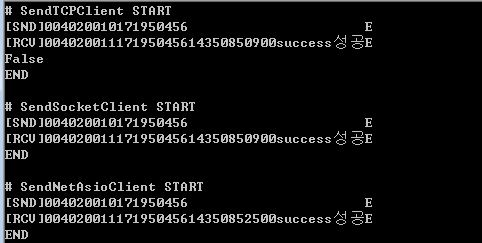

# SocketClientUnitTest
TCP Socket Client Unit Test

## 1. 프로젝트 정보 및 버젼

### *[ SocketClientUnitTest Solution ]	
### *[ SocketClientUnitTest csproj ]	

| 프로젝트 | 설명 | .NET버젼 | SocketClientUnitTest버젼 |
| -------- | -------- | -------- | -------- |
| SocketClientUnitTest | Socket Client Test	| .NET 4.5.1	| SocketClientUnitTest 1.0.0.0 |

## 2. SocketClientUnitTest 정보 및 참조
- NetAsioClient.dll 1.0.0.0
- System.Net.Sockets;
- System.Runtime.InteropServices

## 3. Unit Test Class Type
- TCPClient
- SocketClient
- NetAsioClient

## 4. 참고 정보
- https://docs.microsoft.com/en-us/dotnet/api/system.net.sockets.socket?view=netframework-4.8
- https://docs.microsoft.com/en-us/dotnet/api/system.net.sockets.tcpclient?view=netframework-4.8
- https://trip2ee.tistory.com/23
- https://sunyzero.tistory.com/198
- http://egloos.zum.com/yajino/v/782519

## 5. 샘플

